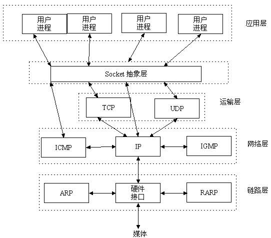

## [HTTP、TCP、UDP以及SOCKET之间的区别/联系](https://www.cnblogs.com/jing99/p/6181488.html)

**一.TCP/IP代表传输控制协议/网际协议，指的是一系列协组。**

　　可分为四个层次：数据链路层、网络层、传输层和应用层。

> 在网络层:有IP协议、ICMP协议、ARP协议、RARP协议和BOOTP协议。
> 在传输层:中有TCP协议与UDP协议。
> 在应用层:有FTP、HTTP、TELNET、SMTP、DNS等协议。

　　TCP和UDP使用IP协议从一个网络传送数据包到另一个网络。把IP想像成一种高速公路，它允许其它协议在上面行驶并找到到其它电脑的出口。TCP和UDP是高速公路上的“卡车”，它们携带的货物就是像HTTP，文件传输协议FTP这样的协议等。
    TCP和UDP是FTP，HTTP和SMTP之类使用的传输层协议。虽然TCP和UDP都是用来传输其他协议的，它们却有一个显著的不同：TCP提供有保证的数据传输，而UDP不提供。这意味着TCP有一个特殊的机制来确保数据安全的不出错的从一个端点传到另一个端点，而UDP不提供任何这样的保证。

**二.HTTP本身就是一个协议，是从Web服务器传输超文本到本地浏览器的传送协议。**

　　HTTP(超文本传输协议)是利用TCP在两台电脑(通常是Web服务器和客户端)之间传输信息的协议。客户端使用Web浏览器发起HTTP请求给Web服务器，Web服务器发送被请求的信息给客户端。

> HTTP协议是建立在请求/响应模型上的。首先由客户建立一条与服务器的TCP链接，并发送一个请求到服务器，请求中包含请求方法、URL、协议版本以及相关的MIME样式的消息。服务器响应一个状态行，包含消息的协议版本、一个成功和失败码以及相关的MIME式样的消息。
>     HTTP/1.0为每一次HTTP的请求/响应建立一条新的TCP链接，因此一个包含HTML内容和图片的页面将需要建立多次的短期的TCP链接。一次TCP链接的建立将需要3次握手。
>     另外，为了获得适当的传输速度，则需要TCP花费额外的回路链接时间（RTT）。每一次链接的建立需要这种经常性的开销，而其并不带有实际有用的数据，只是保证链接的可靠性，因此HTTP/1.1提出了可持续链接的实现方法。HTTP/1.1将只建立一次TCP的链接而重复地使用它传输一系列的请求/响应消息，因此减少了链接建立的次数和经常性的链接开销。

　　虽然HTTP本身是一个协议，但其最终还是基于TCP的。

**三.SOCKET：TCP/IP网络的API。**

 

　　Socket是应用层与TCP/IP协议族通信的**中间软件抽象层**，它是**一组接口**。在设计模式中，Socket其实就是一个门面模式，它把复杂的TCP/IP协议族隐藏在Socket接口后面，对用户来说，一组简单的接口就是全部，让Socket去组织数据，以符合指定的协议。

　　Socket 接口是TCP/IP网络的API，Socket接口定义了许多函数或例程，用以开发TCP/IP网络上的应用程序。

> 这是为了实现以上的通信过程而建立成来的通信管道，其真实的代表是客户端和服务器端的一个通信进程，双方进程通过socket进行通信，而通信的规则
>
> 采用指定的协议。socket只是一种连接模式，不是协议,tcp,udp，简单的说（虽然不准确）是两个最基本的协议,很多其它协议都是基于这两个协议如，http
> 就是基于tcp的，用socket可以创建tcp连接，也可以创建udp连接，这意味着，用socket可以创建任何协议的连接，因为其它协议都是基于此的。

 

**综上所述：需要IP协议来连接网络;TCP是一种允许我们安全传输数据的机制，使用TCP协议来传输数据的HTTP是Web服务器和客户端使用的特殊协议。HTTP基于TCP协议，但是却可以使用socket去建立一个TCP连接。**

　　如图：

　　　　　　　　　　　　　　　　