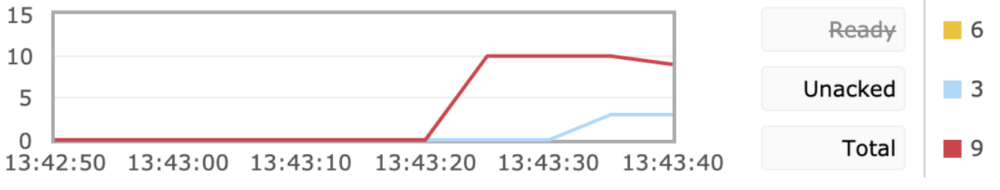

# RabbitMQ


### 消息队列的问题

###### 1.什么是消息队列 ? 

###### 2.为什么要使用消息队列 ?

###### 3.什么样的场景选择什么样的MQ?

###### 4.使用RabbitMQ需要注意的问题?

###### 5.如何使用消息队列?

###### 6.如何配置死信队列 , 以及死信队列的作用

###### 7.如何给消息队列限流 , 以及限流的作用


### 1.消息队列

通常用于A服务与B服务==中间==交互的过程 , RabbitMQ是实现了高级消息队列协议 , (AMQP) 的开源代理软件 , 消息队列，一般我们会简称它为MQ(Message Queue)，嗯，就是很直白的简写。


消息队列可以简单理解为, 把要传输的数据放在队列中


#### 1.1  消息队列的结构与流程


Publisher : 生产者

Consumer : 消费者

Message : 消息

Exchange : 交换机

Queue  : 队列


##### [消息队列精进](https://www.cnblogs.com/linkenpark/p/5393666.html)


### 2.为什么我们要使用消息队列

这个问题其实只需要回答出消息队列的三个经典的使用场景即可 , **==解耦 , 异步 , 削峰==**

#### 解耦  

现在我有一个系统A，系统A可以产生一个userId


然后，现在有系统B和系统C都需要这个userId去做相关的操作


写成伪代码可能是这样的：

> public class SystemA {
>  // 系统B和系统C的依赖
>  SystemB systemB = new SystemB();
>  SystemC systemC = new SystemC();
>  // 系统A独有的数据userId
>  private String userId = "Java3y";
>  public void doSomething() {
>  // 系统B和系统C都需要拿着系统A的userId去操作其他的事
>  systemB.SystemBNeed2do(userId);
>  systemC.SystemCNeed2do(userId);
>
>  }
> }

结构图如下


ok，一切平安无事度过了几个天。

某一天，系统B的负责人告诉系统A的负责人，现在系统B的SystemBNeed2do(String userId)这个接口不再使用了，让系统A别去调它了。

于是，系统A的负责人说"好的，那我就不调用你了。"，于是就把调用系统B接口的代码给删掉了：

public void doSomething() {
 // 系统A不再调用系统B的接口了
 //systemB.SystemBNeed2do(userId);
 systemC.SystemCNeed2do(userId);
}
又过了几天，系统D的负责人接了个需求，也需要用到系统A的userId，于是就跑去跟系统A的负责人说："老哥，我要用到你的userId，你调一下我的接口吧"

于是系统A说："没问题的，这就搞"

 

然后，系统A的代码如下：

public class SystemA {
 // 已经不再需要系统B的依赖了
 // SystemB systemB = new SystemB();

 // 系统C和系统D的依赖
 SystemC systemC = new SystemC();
 SystemD systemD = new SystemD();
 // 系统A独有的数据
 private String userId = "Java3y";
 public void doSomething() {

 // 已经不再需要系统B的依赖了
 //systemB.SystemBNeed2do(userId);
 // 系统C和系统D都需要拿着系统A的userId去操作其他的事
 systemC.SystemCNeed2do(userId);
 systemD.SystemDNeed2do(userId);
 }
}
时间飞逝：

又过了几天，系统E的负责人过来了，告诉系统A，需要userId。
又过了几天，系统B的负责人过来了，告诉系统A，还是重新掉那个接口吧。
又过了几天，系统F的负责人过来了，告诉系统A，需要userId。
…...
于是系统A的负责人，每天都被这给骚扰着，改来改去，改来改去.......

还有另外一个问题，调用系统C的时候，如果系统C挂了，系统A还得想办法处理。如果调用系统D时，由于网络延迟，请求超时了，那系统A是反馈fail还是重试？？

最后，系统A的负责人，觉得隔一段时间就改来改去，没意思，于是就跑路了。

然后，公司招来一个大佬，大佬经过几天熟悉，上来就说：将系统A的userId写到消息队列中，这样系统A就不用经常改动了。为什么呢？下面我们来一起看看：


 

系统A将userId写到消息队列中，系统C和系统D从消息队列中拿数据。这样有什么好处？

系统A只负责把数据写到队列中，谁想要或不想要这个数据(消息)，系统A一点都不关心。
即便现在系统D不想要userId这个数据了，系统B又突然想要userId这个数据了，都跟系统A无关，系统A一点代码都不用改。
系统D拿userId不再经过系统A，而是从消息队列里边拿。系统D即便挂了或者请求超时，都跟系统A无关，只跟消息队列有关。
这样一来，系统A与系统B、C、D都解耦了。

#### 异步

**传统模式:**


传统模式的缺点：

- 一些非必要的业务逻辑以同步的方式运行，太耗费时间。

  

就比如有A,B,C三个服务  **A是创建订单/查看订单** , **B是订单制作/打印** , **C是增长积分** , 在传统模式中, 如果A/B/C的执行时间为**10s**,那么当我们**用户完成以上分布式操作之后一共要等待的时间为10+10+10=30秒** , 这样用户在30秒之后才可以看到订单 , 这样对于用户的体验是不好的

**中间件模式:**


在使用了中间件模式后 , 如果服务B /C 需要使用服务A生产的UserId那么只需要在执行服务A完成之后将生产的UserId放到消息中间件中 , 然后不同的**消费者**去消息队列中获取消息即可, **这样总耗时时间为 10秒**

#### 削峰

**传统模式**:


传统模式的<font style="color:red">缺点</font>：

- 并发量大的时候，所有的请求直接怼到数据库，造成数据库连接异常,让数据库挂掉


**使用了消息中间件之后:**


中间件模式的的<font style="color:red">优点</font>：

- 系统A慢慢的按照数据库能处理的并发量，从消息队列中慢慢拉取消息。在生产中，这个短暂的高峰期积压是允许的。


### 3.消息队列的选择使用问题

实现消息队列的软件是有很多个的 , 那么我们该如何根据自身需求的不同而采用不同的消息队列呢?


(1)中小型软件公司，建议选RabbitMQ.一方面，erlang语言天生具备高并发的特性，而且他的管理界面用起来十分方便。正所谓，成也萧何，败也萧何！他的弊端也在这里，虽然RabbitMQ是开源的，然而国内有几个能定制化开发erlang的程序员呢？所幸，RabbitMQ的社区十分活跃，可以解决开发过程中遇到的bug，这点对于中小型公司来说十分重要。不考虑rocketmq和kafka的原因是，一方面中小型软件公司不如互联网公司，数据量没那么大，选消息中间件，应首选功能比较完备的，所以kafka排除。不考虑rocketmq的原因是，rocketmq是阿里出品，如果阿里放弃维护rocketmq，中小型公司一般抽不出人来进行rocketmq的定制化开发，因此不推荐。
(2)大型软件公司，根据具体使用在rocketMq和kafka之间二选一。一方面，大型软件公司，具备足够的资金搭建分布式环境，也具备足够大的数据量。针对rocketMQ,大型软件公司也可以抽出人手对rocketMQ进行定制化开发，毕竟国内有能力改JAVA源码的人，还是相当多的。至于kafka，根据业务场景选择，如果有日志采集功能，肯定是首选kafka了。具体该选哪个，看使用场景。


### 4.消息队列的使用问题

#### 一.如何保证消息的高可用

以RabbitMQ为例子 , 可以通过集群MQ的方式来实现高可用 , 比如主从模式等 


**场景1：客户端直接连接队列所在节点**

如果有一个消息生产者或者消息消费者通过amqp-client的客户端连接至节点1进行消息的发布或者订阅，那么此时的集群中的消息收发只与节点1相关，这个没有任何问题；如果客户端相连的是节点2或者节点3（队列1数据不在该节点上），那么情况又会是怎么样呢？

**场景2：客户端连接的是非队列数据所在节点**

如果消息生产者所连接的是节点2或者节点3，此时队列1的完整数据不在该两个节点上，那么在发送消息过程中这两个节点主要起了一个路由转发作用，根据这两个节点上的元数据（也就是上文提到的：指向queue的owner node的指针）转发至节点1上，最终发送的消息还是会存储至节点1的队列1上。

同样，如果消息消费者所连接的节点2或者节点3，那这两个节点也会作为路由节点起到转发作用，将会从节点1的队列1中拉取消息进行消费。


#### 二.如何保证消息的可靠性传输

我们在使用消息队列的过程中，应该做到消息不能多消费，也不能少消费。如果无法做到可靠性传输，可能给公司带来千万级别的财产损失。同样的，如果可靠性传输在使用过程中，没有考虑到，这不是给公司挖坑么，你可以拍拍屁股走了，公司损失的钱，谁承担。还是那句话，**认真对待每一个项目，不要给公司挖坑。**

其实这个可靠性传输，每种MQ都要从三个角度来分析:**==生产者弄丢数据、消息队列弄丢数据、消费者弄丢数据==**

**(1)生产者丢数据**

​		从生产者弄丢数据这个角度来看，==RabbitMQ提供 transaction 和 confirm 模式来确保生产者不丢消息==。
transaction机制就是说，发送消息前，开启事务(channel.txSelect())，然后发送消息，如果发送过程中出现什么异常，事物就会回滚(channel.txRollback())，如果发送成功则提交事物(channel.txCommit())。
​		然而缺点就是吞吐量下降了。因此，按照博主的经验，生产上用confirm模式的居多。一旦channel进入confirm模式，所有在该信道上面发布的消息都将会被指派一个唯一的ID(从1开始)，一旦消息被投递到所有匹配的队列之后，rabbitMQ就会发送一个Ack给生产者(包含消息的唯一ID)，这就使得生产者知道消息已经正确到达目的队列了.如果rabiitMQ没能处理该消息，则会发送一个Nack消息给你，你可以进行重试操作

**(2)消息队列丢数据**

​		处理消息队列丢数据的情况，一般是开启持久化磁盘的配置。这个持久化配置可以和confirm机制配合使用，你可以在消息持久化磁盘后，再给生产者发送一个Ack信号。这样，如果消息持久化磁盘之前，rabbitMQ阵亡了，那么生产者收不到Ack信号，生产者会自动重发。
那么如何持久化呢，这里顺便说一下吧，其实也很容易，就下面两步
1、将queue的持久化标识durable设置为true,则代表是一个持久的队列
2、发送消息的时候将deliveryMode=2
这样设置以后，rabbitMQ就算挂了，重启后也能恢复数据

**(3)消费者丢数据**

消费者丢数据一般是因为采用了自动确认消息模式。这种模式下，消费者会自动确认收到信息。这时rahbitMQ会立即将消息删除，这种情况下如果消费者出现异常而没能处理该消息，就会丢失该消息。
至于解决方案，==采用手动确认消息即可==。


#### 三.如何保证消息不会被重复消费

通常情况下重复消费都是因为消息队列重复的给消费者推送消息造成的

可以给消息增加**==幂等性==**

如果这个消息的消费者是要利用这个消息进行DML操作 , 那么可以在这个消息中 , 设定一个全局的唯一的id , 在添加的时候添加失败就可以了 , 


#### 四.如何保证消息的顺序性

可以给某些服务设置延时等待 , 比如睡眠


### 5.如何使用


##### 导入依赖

```xml
<dependency>
	<groupId>org.springframework.boot</groupId>
	<artifactId>spring-boot-starter-amqp</artifactId>
</dependency>	
```

##### 配置连接地址

```yml
spring.rabbitmq.host=192.168.168.134
```

##### 创建生产者

```java
/**
 * 普通模式生产者
 */
@Controller
public class ProducerQueue {
    /**
     * 引用Rabbit模板
     */
    @Autowired
    private RabbitTemplate rabbitTemplate;

    @ResponseBody
    @RequestMapping("hello")
    public Object hello() {
        String message = "hello";
        //1.交换机     2.路由key     3.消息内容
        rabbitTemplate.convertAndSend("", "boot_queue", message);
        return "发送成功";
    }
}
```


worker

```java
/**
 * 创建worker模式生产者
 */
@Controller
public class ProducerWorker {
    /**
     * 引用Rabbit模板
     */
    @Autowired
    private RabbitTemplate rabbitTemplate;

    @ResponseBody
    @RequestMapping("worker")
    public Object hello() {
        String message = "hello";
        for (int i = 0; i < 20; i++) {
            //1.绑定哪一个交换机       2.发送的路由key           3.消息的信息
            rabbitTemplate.convertAndSend("", "boot_worker", message);
        }
        return "发送成功";
    }
}
```


广播

```java
@Controller
public class PubSubController {
    @Autowired
    private RabbitTemplate rabbitTemplate;
    @RequestMapping("/pubsub")
    @ResponseBody
    public String sendMsg(String msg){
        rabbitTemplate.convertAndSend("boot_pubsub","","广播消息");
        return "发送成功";
    }
}
```

需要写交换机 但是由于是广播 , 可以不用写路由key 因为谁订阅谁就可以获取消息


路由

```java
@Controller
public class RountingController {
    @Autowired
    private RabbitTemplate rabbitTemplate;
    @RequestMapping("/rounting")
    @ResponseBody
    public String sendMsg(String key){
        //一种以路由key方式  发送连接的生产者
        rabbitTemplate.convertAndSend("boot_rounting_exchange",key,"rounting消息");
        return "发送成功";
    }
}
```


top模式

```java
@Controller
public class TopicController {
    @Autowired
    private RabbitTemplate rabbitTemplate;
    @RequestMapping("/topic")
    @ResponseBody
    public String sendMsg(String key){
        rabbitTemplate.convertAndSend("boot_topic_exchange",key,"topic消息");
        return "发送成功";
    }
}
```


##### 创建消费者

```java
/**
 * 普通消息的消费者
 */
@Component
public class QueueListener {
    @RabbitListener(queuesToDeclare = @Queue("boot_queue"))
    public void receiveMsg(String msg, @Header(AmqpHeaders.DELIVERY_TAG) long deliveryTag, Channel channel) {
        System.out.println("收到消息:" + msg);
    }
}
```


worker

```java
@Component
public class ProductQueueListener {

    //绑定消息队列                                    
    @RabbitListener(queuesToDeclare = @Queue("boot_worker"))
    public void recevicesMsg(String message, @Header(AmqpHeaders.DELIVERY_TAG) long deliveryTag, Channel channel) throws Exception {
        //用于手动提交ack
        channel.basicAck(deliveryTag, false);
        System.out.println("收到消息" + message);
    }
}
```


广播

```java
@Component
public class PubSubReceiver {
    @RabbitListener(bindings = @QueueBinding(value = @Queue,exchange = @Exchange(name = "boot_pubsub",type = "fanout")))
    public void receiveMsg(String msg, @Header(AmqpHeaders.DELIVERY_TAG)long deliveryTag, Channel channel) throws Exception {
        System.out.println("收到消息1:"+msg);
        channel.basicAck(deliveryTag,false);
    }
}


```


路由

````java
@Component
public class RountingReceiver {
    @RabbitListener(bindings = @QueueBinding(value = @Queue,
            exchange = @Exchange(name = "boot_rounting_exchange",type = "direct"),
            key = {"error","info"}
    ))
    public void receiveMsg(String msg, @Header(AmqpHeaders.DELIVERY_TAG)long deliveryTag, Channel channel) throws Exception {
        System.out.println("error&info 收到消息:"+msg);
        channel.basicAck(deliveryTag,false);
    }
}
````


top

```java
@Component
public class TopicReceiver01 {
    @RabbitListener(bindings = @QueueBinding(
            value = @Queue,
            exchange = @Exchange(name = "boot_topic_exchange",type = "topic"),
            key = "order.*"
    ))
    public void receiveMsg(String msg, @Header(AmqpHeaders.DELIVERY_TAG)long deliveryTag, Channel channel) throws Exception {
        System.out.println("topic收取消息:"+msg);
        channel.basicAck(deliveryTag,false);
    }
}
```


> `@RabbitListener` : 用于监听RabbitMQ消息 从消息队列中
>
> > 参数
> >
> > queuesToDeclare = @Queue("boot_queue")     用于绑定消息中队列
> >
> > ` @Queue` : 用于绑定队列
>
>  ```java
> //用于手动提交ack
> channel.basicAck(deliveryTag, false);
>  ```
>
> > 参数
> >
> > bindings = @QueueBinding(value = @Queue,exchange = @Exchange(name = "boot_pubsub",type = "fanout"))
> >
> > `@QueueBinding` : 用于设定绑定的队列以及交换机
> >
> > `@Exchange` : 绑定哪一个交换机  <font style="color:red"> (**name**="交换机的名称", **type**="通知的类型")</font>
>
> > 参数
> >
> > @QueueBinding(**key = {"error","info"}**)
> >
> > 路由模式 : 当路由的key满足以上字段就会给消费者通知


### 6. 死信队列 

[死信队列](https://www.cnblogs.com/mfrank/p/11184929.html)

[消息队列RabbitMq的五种形式队列](https://blog.csdn.net/qq_36838191/article/details/79914274)

#### 死信队列的使用以及作用


### 7. RabbitMQ限流

> #### 为什么要对消费端限流

假设一个场景，首先，我们 Rabbitmq 服务器积压了有上万条未处理的消息，我们随便打开一个消费者客户端，会出现这样情况: 巨量的消息瞬间全部推送过来，但是我们单个客户端无法同时处理这么多数据!

当数据量特别大的时候，我们对生产端限流肯定是不科学的，因为有时候并发量就是特别大，有时候并发量又特别少，我们无法约束生产端，这是用户的行为。所以我们应该对消费端限流，用于保持消费端的稳定，当消息数量激增的时候很有可能造成资源耗尽，以及影响服务的性能，导致系统的卡顿甚至直接崩溃。

> ####  2.限流的 api 讲解

RabbitMQ 提供了一种 qos （服务质量保证）功能，即在非自动确认消息的前提下，如果一定数目的消息（通过基于 consume 或者 channel 设置 Qos 的值）未被确认前，不进行消费新的消息。

```java
/**
* Request specific "quality of service" settings.
* These settings impose limits on the amount of data the server
* will deliver to consumers before requiring acknowledgements.
* Thus they provide a means of consumer-initiated flow control.
* @param prefetchSize maximum amount of content (measured in
* octets) that the server will deliver, 0 if unlimited
* @param prefetchCount maximum number of messages that the server
* will deliver, 0 if unlimited
* @param global true if the settings should be applied to the
* entire channel rather than each consumer
* @throws java.io.IOException if an error is encountered
*/
void basicQos(int prefetchSize, int prefetchCount, boolean global) throws IOException;

```

- **prefetchSize**：0，单条消息大小限制，0代表不限制

- **prefetchCount**：一次性消费的消息数量。会告诉 RabbitMQ 不要同时给一个消费者推送多于 N 个消息，即一旦有 N 个消息还没有 ack，则该 consumer 将 block 掉，直到有消息 ack。

- **global**：true、false 是否将上面设置应用于 channel，简单点说，就是上面限制是 channel 级别的还是 consumer 级别。当我们设置为 false 的时候生效，设置为 true 的时候没有了限流功能，因为 channel 级别尚未实现。

- 注意：prefetchSize 和 global 这两项，rabbitmq 没有实现，暂且不研究。特别注意一点，prefetchCount 在 no_ask=false 的情况下才生效，即在自动应答的情况下这两个值是不生效的。

  

> 3.如何对消费端进行限流

- 首先第一步，我们既然要使用消费端限流，我们需要关闭自动 ack，将 autoAck 设置为 false `channel.basicConsume(queueName, false, consumer);`
- 第二步我们来设置具体的限流大小以及数量。`channel.basicQos(0, 15, false);`
- 第三步在消费者的 handleDelivery 消费方法中手动 ack，并且设置批量处理 ack 回应为 true`channel.basicAck(envelope.getDeliveryTag(), true);`

这是生产端代码，与前几章的生产端代码没有做任何改变，主要的操作集中在消费端。

```java
Copyimport com.rabbitmq.client.Channel;
import com.rabbitmq.client.Connection;
import com.rabbitmq.client.ConnectionFactory;

public class QosProducer {
    public static void main(String[] args) throws Exception {
        //1. 创建一个 ConnectionFactory 并进行设置
        ConnectionFactory factory = new ConnectionFactory();
        factory.setHost("localhost");
        factory.setVirtualHost("/");
        factory.setUsername("guest");
        factory.setPassword("guest");

        //2. 通过连接工厂来创建连接
        Connection connection = factory.newConnection();

        //3. 通过 Connection 来创建 Channel
        Channel channel = connection.createChannel();

        //4. 声明
        String exchangeName = "test_qos_exchange";
        String routingKey = "item.add";

        //5. 发送
        String msg = "this is qos msg";
        for (int i = 0; i < 10; i++) {
            String tem = msg + " : " + i;
            channel.basicPublish(exchangeName, routingKey, null, tem.getBytes());
            System.out.println("Send message : " + tem);
        }

        //6. 关闭连接
        channel.close();
        connection.close();
    }
}
```

这里我们创建一个消费者，通过以下代码来验证限流效果以及 `global` 参数设置为 `true` 时不起作用.。我们通过`Thread.sleep(5000);` 来让 ack 即处理消息的过程慢一些，这样我们就可以从后台管理工具中清晰观察到限流情况。

```java
Copyimport com.rabbitmq.client.*;
import java.io.IOException;
public class QosConsumer {
    public static void main(String[] args) throws Exception {
        //1. 创建一个 ConnectionFactory 并进行设置
        ConnectionFactory factory = new ConnectionFactory();
        factory.setHost("localhost");
        factory.setVirtualHost("/");
        factory.setUsername("guest");
        factory.setPassword("guest");
        factory.setAutomaticRecoveryEnabled(true);
        factory.setNetworkRecoveryInterval(3000);

        //2. 通过连接工厂来创建连接
        Connection connection = factory.newConnection();

        //3. 通过 Connection 来创建 Channel
        final Channel channel = connection.createChannel();

        //4. 声明
        String exchangeName = "test_qos_exchange";
        String queueName = "test_qos_queue";
        String routingKey = "item.#";
        channel.exchangeDeclare(exchangeName, "topic", true, false, null);
        channel.queueDeclare(queueName, true, false, false, null);

        channel.basicQos(0, 3, false);

        //一般不用代码绑定，在管理界面手动绑定
        channel.queueBind(queueName, exchangeName, routingKey);

        //5. 创建消费者并接收消息
        Consumer consumer = new DefaultConsumer(channel) {
            @Override
            public void handleDelivery(String consumerTag, Envelope envelope,
                                       AMQP.BasicProperties properties, byte[] body)
                    throws IOException {
                try {
                    Thread.sleep(5000);
                } catch (InterruptedException e) {
                    e.printStackTrace();
                }
                String message = new String(body, "UTF-8");
                System.out.println("[x] Received '" + message + "'");

                channel.basicAck(envelope.getDeliveryTag(), true);
            }
        };
        //6. 设置 Channel 消费者绑定队列
        channel.basicConsume(queueName, false, consumer);
        channel.basicConsume(queueName, false, consumer1);
    }
}
```

我们从下图中发现 `Unacked`值一直都是 3 ，每过 5 秒 消费一条消息即 Ready 和 Total 都减少 3，而 `Unacked`的值在这里代表消费者正在处理的消息，通过我们的实验发现了消费者一次性最多处理 3 条消息，达到了消费者限流的预期功能。

[](https://img2018.cnblogs.com/blog/1543774/201906/1543774-20190601135236406-1764031047.png)

当我们将`void basicQos(int prefetchSize, int prefetchCount, boolean global)`中的 global 设置为 `true`的时候我们发现并没有了限流的作用。


### 8. 消息的过期时间


[消息队列详解](https://blog.csdn.net/hellozpc/article/details/81436980)

### 消息队列精进

#### Virtualhost

Virtualhost是什么?

Virtualhost的作用?

创建RabbitMQ的 "数据库" `virtualhost`

[创建virtualhost](https://www.rabbitmq.com/vhosts.html)


[消息队列限流,TTL,死信队列](https://www.cnblogs.com/haixiang/p/10905189.html)


