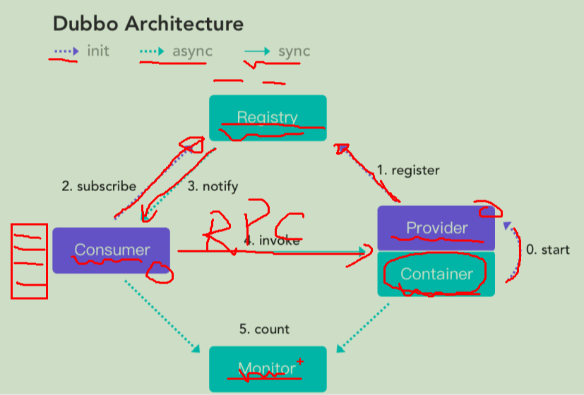

# Dubbo

## **什么是Dubbo**

Dubbo是一款基于微服务概念并实现微服务项目的框架

Dubbo是阿里巴巴公司开源的一个高性能优秀的服务框架，使得应用可通过高性能的 RPC 实现服务的输出和输入功 能，可以和Spring框架无缝集成。 Dubbo是一款高性能、轻量级的开源Java RPC框架，它提供了三大核心能力：面向接口的远程方法调用，智能容错和**负载均衡**，以及服务自动注册和发现。


## **Dubbo能做什么**

使用Dubbo能开发微服务的项目


## **Dubbo的执行流程**

### **核心组件**

Remoting: 网络通信框架，实现了 sync-over-async 和 request-response 消息机制.
RPC: 一个远程过程调用的抽象，支持负载均衡、容灾和集群功能
Registry: 服务目录框架用于服务的注册和服务事件发布和订阅


### **流程图**





# **在Dubbo中使用的注册中心组件是zookeeper**

1. 生产者启动Dubbo容器，生产服务对象
2. 生产者把生成的服务发布到注册中心
3. 消费者向注册中心订阅服务，把发布的服务，下载到本地缓存，订阅服务后，本地缓存会自动更新生产者发布
的服务
4. 当消费者需要调用服务时，按照RPC协议要求，向生产者发起服务的调用
5. 生产者把返回的对象交给Dubbo容器进行序列化处理后返回给消费者
6. 消费者接收到返回的数据后对其反序列化，得到Java对象
7. 监视器对服务性能做监控统计


# **如何使用Dubbo**

加载依赖

```xml
        <!--控制中心 zookeeper-->
		<dependency>
            <groupId>org.apache.curator</groupId>
            <artifactId>curator-recipes</artifactId>
            <version>2.12.0</version>
        </dependency>
		<!--dubbo-->
		<dependency>
            <groupId>org.apache.dubbo</groupId>
            <artifactId>dubbo</artifactId>
            <version>2.7.0</version>
        </dependency>
		<!--dubbo关联spring-->
		<dependency>
            <groupId>org.apache.dubbo</groupId>
            <artifactId>dubbo-spring-boot-starter</artifactId>
            <version>2.7.0</version>
        </dependency>
```


# **搭配spring配置文件**

## 生产者

```java
#配置发布的名称
dubbo.application.name=member-server
#协议名称
dubbo.protocol.name=dubbo
#配置发布到注册中心的地址
dubbo.registry.address=zookeeper://127.0.0.1:2181
#配置访问端口
dubbo.protocol.port=20881
#允许Bean的覆盖
spring.main.allow-bean-definition-overriding=true
```


## 消费者

```java
#配置连接名称
dubbo.application.name=webSite
#配置发布的名称
dubbo.registry.address=zookeeper://127.0.0.1:2181
#允许Bean的覆盖
spring.main.allow-bean-definition-overriding=true
server.port=80
#消费者不检测服务是否存在 
dubbo.consumer.check=fals
```


## 注解 : 

##### **@Reference**

```java
@Reference
private IProductService productService;
//用来获取接口的真实对象
```

##### **@Service**

```java
import org.apache.dubbo.config.annotation.Service;
@Service
//使用 dubbo的service注解来通知该类是一个生产者
```

##### **@EnableDubbo**

```java
@EnableDubbo
//配置在启动类中  作用是扫描service注解
```


##### **Dubbo的优点和缺点**

安装简单 

和spring集成

能够开发微服务项目并处理微服务项目遇到的大多数的问题


# **注意事项**

动态代理

Dubbo的底层消费者之所以能够发送RPC协议是因为 阿里巴巴在底层使用了一个特殊的动态代理来实现消费者与生产者的连接建立


##### **负载均衡**

Dubbo的负载均衡默认是随机分配 如果要修改可以修改配置文件来达到业务需要的效果


**Bean覆盖问题**

由于Spring中自带了一个bean与dubbo加载的bean冲突所以会失败

##### **Zookeepar**

**控制中心**

使用Dubbo最好是把控制中心打开 免得每次访问还要指定访问的端口并且也无法及时的获取到生产者生产的数据最新消息

**使用方法**

G:\zookep\zookeeper-3.4.14\bin 文件下面运行就可以了


##### **可视化图形**

在C:\Users\Zhangxinuser\Desktop\学习资料\SpringBoot\Dubbo文件下面使用`java命令`运行


在管控台中账号密码都是 root

默认端口：7001 ，账号密码都是root


##### **Dubbo的服务治理**

Dubbo提供的功能还有很多，我们可以从官方文档中去学习怎么做个性的功能配置


文档地址：http://dubbo.apache.org/zh-cn/docs/user/quick-start.html


##### **启动检测**

在实际开发中，经常会存在服务交叉引用的情况，如：A服务引用B服务，B服务也引用A服务，那么此时就存在问 

题，无论哪个服务在启动时都会报错

此时我们可以设置**消费者**项目启动时不要去检查服务是否存在，就可以顺利的启动项目了，但是在运行时服务依然不存在的话，还是会报错

```sql
#消费者不检测服务是否存在 
dubbo.consumer.check=false
```


##### **服务集群**

只有一个服务对象时，所有压力都落在同一个对象上，逼近极限时很可能导致服务挂掉，我们可以通过多发布几个服务对象，通过负载均衡策略来缓解单一服务对象压力过大问题

1. 生产者多发布几个服务对象，注意修改多个服务发布的端口

   ```sql
   # 生产者发布端口 
   dubbo.protocol.port=20880 #生产者A 
   # ------------ 
   dubbo.protocol.port=20883 #生产者B 
   # ------------ 
   ```

   

2. 消费者加载负载均衡

   RandomLoadBalance：随机（random），默认策略 

   RoundRobinLoadBalance：轮询（roundrobin） 

   ConsistentHashLoadBalance：hash一致（consistenthash） 

   LeastActiveLoadBalance：最少活跃（leastactive） 

   ```sql
   #appliaction.properties 
   
   #修改消费者负载均衡策略 
   
   dubbo.consumer.loadbalance=roundrobin
   ```

   

##### **多版本发布**


```java
@Service(version="1.0") 
public class UserServiceImpl implements IUserService { ... } 

@Service(version="2.0") 
public class UserServiceImpl implements IUserService { ... }
```

如果引用了版本号消费者就必须要指定使用哪个版本的服务

```java
@Reference(version="1.0") 
private IUserService userService; 
@Reference(version="2.0") 
private IUserService userService; @Reference(version="*")
//随机引用 private IUserService userService;
```


##### **服务超时，重试，容错**

在服务调用的过程中，有可能服务生产者网络环境差，但是消费者并不知道，依然发出请求，长时间没有回应，此时我们可以设置消费者等待的超时时间，当调用超过设置的时间时放弃等待远程的响应，默认超时时间是：1s 

当发生超时时，框架并不会马上就放弃服务的调用，还会进行重试，默认重试次数：2次


我们可以修改消费端的配置来改变默认的超时时间和重试次数

```sql
#消费者设置超时时间1.5s 
dubbo.consumer.timeout=1500 
#消费者设置重试次数，重试1次 
dubbo.consumer.retries=1 
#注意：只有幂等性操作才能重试，非幂等性操作是不能重试的
```


此时**因超时调用失败**，出现的报错页面会直接的反馈给消费者，消费者再把报错信息响应出去，用户就会直接看到错误页面，这样不友好，而且用户也看不懂，应该对错误信息进行处理，给用户一个**稍微正常**点的数据，这个就是服务的容错 

从Dubbo Admin控制台去配置当前服务的容错，当服务不能正常调用时，返回null代替异常的信息


另外，服务集群后还能配置集群下的容错机制，有以下策略可以选择：

```sql
FailoverCluster：失败自动切换，默认策略，用于幂等性操作，如：查询 
FailfastCluster：快速失败，只发起一次调用，失败立即报错，用于非幂等性操作，如：插入数据 FailsafeCluster：失败安全，出现异常时，直接忽略。通常用于写入审计日志等操作 
FailbackCluster：失败自动恢复，后台记录失败请求，定时重发。通常用于消息通知操作 
ForkingCluster：并行调用多个服务器，只要一个成功即返回。通常用于实时性要求较高的读操作，但需要浪费更多服务 资源。可通过 forks="2" 来设置最大并行数 
BroadcastCluster：广播调用所有提供者，逐个调用，任意一台报错则报错。通常用于通知所有提供者更新缓存或日志等 本地资源信息
```

```sql
#客户端配置服务集群容错策略 
dubbo.consumer.cluster=failfast
```

##### **服务降级**

当服务器压力剧增的情况下，根据实际业务情况及流量，对一些服务和页面有策略的不处理或换种简单的方式处理,从而释放服务器资源以保证核心交易正常运作或高效运作。


此时我们要保证服务B能抗住压力，就只能去牺牲服务A，甚至直接把服务A功能关闭掉，把资源留给服务B使用，此时我们就可以对服务A进行降级处理从Dubbo Admin控制台去配置当前服务的降级，客户端访问降级的服务时，不发起远程调用请求，直接返回null


