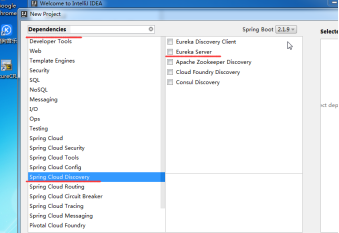
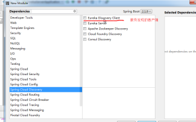

# SpringCloud


1. 什么是SpringCloud

2. 在了解SpringCloud前 , 我们需要知道传统的单体程序与分布式程序的区别

3. 使用SpringCloud能为我们解决什么问题

4. 如何使用SpringCloud
5. 注意事项


### 1.什么是SpringCloud

Spring Cloud是一系列框架的有序集合。它利用[Spring Boot](https://baike.baidu.com/item/Spring Boot/20249767)的开发便利性巧妙地简化了分布式系统基础设施的开发，如**服务发现注册**、**配置中心**、**消息总线**、**负载均衡**、**断路器**、**数据监控**等，都可以用Spring Boot的开发风格做到一键启动和部署。

简单来讲就是针对Spring Boot的开发的便利性的整合框架


### 2.单体程序与分布式程序的区别

- **单体应用程序** 就是指整个项目是一个单线性的程序 , 最大的特点就是 , 从 ==客户端 → 服务器 → 客户端== 的这个过程中, 内部只有一个服务器 在支撑用户的访问 , 处理业务逻辑 , 这样对于一些简单的并发 而言已经足够了 , 如果并发稍微上升,  也可以对单体的程序做简单地 **分布式处理**

- **分布式集群**  就是指tomcat集群起来 , 相同的事情都准备一份 ,这样就叫做集群 , 换句话说就是多个tomcat处理一个应用程序 , 避免并发带来的 , 服务器压力

- **微服务** 就是指将业务中不同的模块或者功能 , 进行拆分 , 从而拆分出大大小小不同的服务 , 然后在由不同服务的并发量来决定为哪些服务集群 , 这样做可以有效的处理并发带来的问题 , 也可以通过 ==`负载均衡` , `熔断降级`== 等一系列手段 , 应付那些极致的并发量

分布式更多的情况是通过部署 tomcat的方式来完成的 , 在工作的时候超过一台系统的服务器 , 就可以被称为分布式

==微服务不一定是分布式 , 如果微服务部署在同一个tomcat中 , 那么微服务将没有任何意义 , 但是微服务的建立, 就是为了解决分布式的问题 , 所以可以等价的看成 , 微服务的创建 , 就是用来做分布式的==


### 3.SpringCloud的应用场景

在springCloud中集成了很多处理分布式 , 高并发的框架 , 通常我们使用比较多的就是 , `eureka注册中心` , `ribbon(基于eureka的远程服务调用方式)` , `config(配置中心)` , `Sleuth&Zipkin(链路追踪)` , `zuul(网关)` ,`hystrix(服务的熔断与降级)` , `feign(微服务项目更合理的远程调用访问)`

通过上述的框架与组件 , 自由的组合搭配 , 达到我们分布式的高可用 , 高并发的处理目的


[最后结构图]()


### 4.使用SpringCloud

方式一 :

- 通过idea中内置的springBoot项目构建工具 在搭建SpringBoot项目的同时勾选springCloud相关联的依赖 , 创建出SpringCloud的**eureka**注册中心  **如下所示**



```java
	//相关依赖
  <dependencyManagement>
        <dependencies>
            <dependency>
                <groupId>org.springframework.cloud</groupId>
                <artifactId>spring-cloud-dependencies</artifactId>
                <version>${spring-cloud.version}</version>
                <type>pom</type>
                <scope>import</scope>
            </dependency>
        </dependencies>
    </dependencyManagement>
    //eureka注册中心的依赖
    <dependency>
            <groupId>org.springframework.cloud</groupId>
            <artifactId>spring-cloud-starter-netflix-eureka-server</artifactId>
    </dependency>
```

```yaml
#注册中心的依赖
server:
  port: 8761
eureka:
  instance:
    hostname: localhost
  client:
    registerWithEureka: false
    fetchRegistry: false
    serviceUrl:
      defaultZone: http://${eureka.instance.hostname}:${server.port}/eureka/
```


**启动类上贴上<font style="color:red">@EnableEurekaServer</font>注解**


 注 : 注册中心在整个SpringCloud中起到了至关重要的地位 , 详情请看[eureka注册中心篇]()


- 在创建了注册中心的服务后 , 我们可以创建我们业务所对应的服务 , **商品服务** , 也是通过一样的办法SpringBoot的集成方式创建出来 , 然后勾选eureka注册中心 **服务的客户端**  **如下所示**

  

  ```java
  //相关依赖
          <dependency>
              <groupId>org.springframework.cloud</groupId>
              <artifactId>spring-cloud-starter-netflix-eureka-server</artifactId>
          </dependency>
  ```


- 创建好服务的生产者后 , 继续创建服务的消费者 方法如上

  

  ```java
         //服务的监听者
  		<dependency>
              <groupId>org.springframework.cloud</groupId>
              <artifactId>spring-cloud-starter-netflix-eureka-client</artifactId>
          </dependency>
  ```

  ```yaml
  #服务的相关依赖
  server:
    port: 8081
  spring:
    application:
      name: product-server
  eureka:
    client:
      serviceUrl:
        defaultZone: http://localhost:8761/eureka/
  ```

  在启动类上面贴<font style="color:red"></font>

  

### 5.注意事项

**版本号** 统一用 2.1.9

